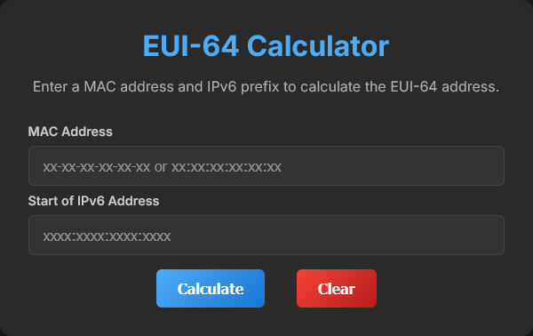

<!-- markdownlint-disable -->
<div align="center">

# EUI-64 Calculator

A EUI-64 address calculator implemented in Go, HTMX, and Templ.

Inspired by [ThePrincelle's EUI64-Calculator](https://github.com/ThePrincelle/EUI64-Calculator)

### Also available at <https://eui64-calculator.nickfedor.com>


<br/><br/>
<!-- markdownlint-restore -->

  [](https://dl.circleci.com/status-badge/redirect/gh/nicholas-fedor/eui64-calculator/tree/main)
  [](https://codecov.io/gh/nicholas-fedor/eui64-calculator)
  [](https://godoc.org/github.com/nicholas-fedor/eui64-calculator)
  [](https://github.com/nicholas-fedor/eui64-calculator/releases)
  [](https://www.gnu.org/licenses/agpl-3.0)
  [](https://www.codacy.com/gh/nicholas-fedor/eui64-calculator/dashboard?utm_source=github.com&amp;utm_medium=referral&amp;utm_content=nicholas-fedor/eui64-calculator&amp;utm_campaign=Badge_Grade)
  [](#contributors)
  [](https://hub.docker.com/r/nickfedor/eui64-calculator)

</div>

## Overview

This project is a simple web app for calculating EUI-64 IPv6 addresses.

## Usage

1. Enter a MAC Address in the format `xx-xx-xx-xx-xx-xx`.
2. Enter an IPv6 Prefix.
3. Click `Calculate` to see the results.

## Getting Started

### Docker Deployment

#### Quick Start

```console
docker run -d --name eui64-calculator nickfedor/eui64-calculator:latest
```

#### Docker Compose

- Running the [Basic Template](/examples/docker-compose.yaml):

    ```console
    docker compose -f ./examples/docker-compose.yaml up -d
    ```

- Traefik Reverse Proxy [example](/examples/Traefik/README.md)

### Running Locally

#### Prerequisites

- Go 1.26+: <https://go.dev/doc/install>
- Templ: <https://github.com/a-h/templ>
- Make (optional, for Makefile targets)
- [Task](https://taskfile.dev/installation/) (optional, for Taskfile targets)

#### Installation

1. Clone the repository:

    ```console
    git clone https://github.com/nicholas-fedor/eui64-calculator.git
    ```

2. Enter the repository:

    ```console
    cd eui64-calculator
    ```

3. Install dependencies and generate templ files:

    ```console
    make generate
    ```

4. Run the server:

    ```console
    make run
    ```

5. The application will be accessible at <http://localhost:8080/>

## Development

### Build Automation

This project provides both a `Makefile` and a `Taskfile.yml` for build automation. Both offer the same set of targets.

#### Available Targets

| Target                    | Description                                        |
|---------------------------|----------------------------------------------------|
| `all` / `check`           | Full CI check (lint, vet, test)                    |
| `generate`                | Run `go generate` for templ code generation        |
| `lint`                    | Run golangci-lint with project configuration       |
| `vet`                     | Run `go vet` for static analysis                   |
| `fmt`                     | Format code and organize imports via golangci-lint |
| `test`                    | Run all tests                                      |
| `test-race`               | Run tests with the race detector enabled           |
| `test-coverage` / `cover` | Run tests with HTML coverage report                |
| `bench`                   | Run all benchmark tests                            |
| `run`                     | Run the server locally with version injection      |
| `mod-tidy`                | Tidy and verify go.mod dependencies                |
| `docker-build`            | Build binary and Docker image                      |
| `docker-run`              | Build and run the Docker container                 |
| `release`                 | Create a release build with GoReleaser             |
| `clean`                   | Remove build artifacts and generated files         |

**Make:**

```console
make <target>
```

**Task:**

```console
task <target>
```

### Project Structure

```text
.
├── .github
│   ├── assets
│   │   ├── eui64-calculator_screenshot.png
│   │   └── eui64-calculator_social-preview_1280x640.png
│   ├── ISSUE_TEMPLATE
│   │   ├── bug_report.yaml
│   │   ├── config.yaml
│   │   └── feature_request.yaml
│   ├── renovate.json
│   └── workflows
│       ├── build.yaml
│       ├── clean-cache.yaml
│       ├── create-manifests.yaml
│       ├── deploy-gh-pages.yaml
│       ├── lint-gh.yaml
│       ├── lint-go.yaml
│       ├── pull-request.yaml
│       ├── release.yaml
│       ├── security.yaml
│       ├── test.yaml
│       └── update-go-docs.yaml
├── build
│   ├── docker
│   │   ├── .dockerignore
│   │   └── Dockerfile
│   ├── gh-pages
│   │   ├── static-gen/
│   │   ├── static/
│   │   └── wasm/
│   ├── golangci-lint
│   │   └── golangci-lint.yaml
│   └── goreleaser
│       └── goreleaser.yaml
├── cmd
│   └── server
│       ├── static
│       │   ├── favicon.ico
│       │   └── styles.css
│       ├── main.go
│       └── main_test.go
├── internal
│   ├── eui64
│   │   ├── eui64.go
│   │   └── eui64_test.go
│   ├── handlers
│   │   ├── handlers.go
│   │   └── handlers_test.go
│   ├── ui
│   │   ├── doc.go
│   │   ├── generate.go
│   │   ├── home.templ
│   │   ├── home_templ.go
│   │   ├── layout.templ
│   │   ├── layout_templ.go
│   │   ├── result.templ
│   │   ├── result_templ.go
│   │   └── ui_test.go
│   └── validators
│       ├── doc.go
│       ├── ipv6_prefix_validator.go
│       ├── ipv6_prefix_validator_test.go
│       ├── mac_validator.go
│       └── mac_validator_test.go
├── examples
│   ├── Traefik
│   │   ├── .env
│   │   ├── README.md
│   │   ├── docker-compose.yaml
│   │   └── traefik.yaml
│   └── docker-compose.yaml
├── .circleci
│   └── config.yml
├── .codacy.yml
├── .gitattributes
├── .gitignore
├── .vscode
│   └── settings.json
├── go.mod
├── go.sum
├── LICENSE
├── Makefile
├── README.md
└── Taskfile.yml
```

### Dependencies

- [Fiber](https://github.com/gofiber/fiber): HTTP web framework
- [Templ](https://github.com/a-h/templ): Type-safe HTML templating
- [HTMX](https://htmx.org/docs): Frontend interactivity

### IDE Support

If you're using VS Code, an `extensions.json` file with recommended extensions is included in the `.vscode` directory.

### Managing Templ Files

Templ files (`.templ`) are compiled to Go via `go generate`. To regenerate after editing `.templ` files:

```console
make generate
```

This runs `go generate ./...`, which invokes the `templ` CLI for all packages containing `//go:generate` directives.

### Testing

- Run all tests:

    ```console
    make test
    ```

- Run tests with the race detector:

    ```console
    make test-race
    ```

- Generate a coverage report:

    ```console
    make test-coverage
    ```

    The HTML report is written to `coverage/coverage.html`.

### Linting

The project uses [golangci-lint](https://golangci-lint.run/) with a comprehensive configuration at `build/golangci-lint/golangci-lint.yaml`.

```console
make lint
```

To format code according to the project's style rules:

```console
make fmt
```

### Docker

- Build the Docker image:

    ```console
    make docker-build
    ```

- Run the container locally:

    ```console
    make docker-run
    ```

### Notes

- The Dockerfile uses `FROM scratch` as the base image, resulting in a minimal container without a shell or other OS-level utilities.
- The server defaults to port `8080`. Override with the `PORT` environment variable.
- Trusted reverse proxies can be configured via the `TRUSTED_PROXIES` environment variable (comma-separated list of IP addresses).

## Contributors

<!-- ALL-CONTRIBUTORS-LIST:START - Do not remove or modify this section -->
<!-- prettier-ignore-start -->
<!-- markdownlint-disable -->

<table>
  <tbody>
    <tr>
      <td align="center" valign="top" width="14.28%"><a href="https://github.com/nicholas-fedor"><br /><sub><b>Nicholas Fedor</b></sub></a><br /><a href="https://github.com/nicholas-fedor/eui64-calculator/commits?author=nicholas-fedor" title="Code">💻</a> <a href="https://github.com/nicholas-fedor/eui64-calculator/commits?author=nicholas-fedor" title="Documentation">📖</a> <a href="#maintenance-nicholas-fedor" title="Maintenance">🚧</a> <a href="https://github.com/nicholas-fedor/eui64-calculator/pulls?q=is%3Apr+reviewed-by%3Anicholas-fedor" title="Reviewed Pull Requests">👀</a></td>
    </tr>
  </tbody>
</table>

<!-- markdownlint-restore -->
<!-- prettier-ignore-end -->

<!-- ALL-CONTRIBUTORS-LIST:END -->

## Contributing

This was a weekend project and there's plenty of opportunity for improvement.

If you feel like contributing, please:

- Fork the repo
- Create your feature branch: `git checkout -b feature/AmazingFeature`
- Commit your changes: `git commit -m "Add some AmazingFeature"`
- Push to the branch: `git push origin feature/AmazingFeature`
- Open a pull request

## License

This project is licensed under the [GNU Affero General Public License](LICENSE.md).
