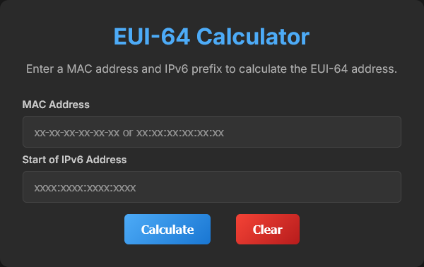

<div align="center">

# EUI-64 Calculator

A EUI-64 address calculator implemented in Go, HTMX, and Templ.

This project was inspired by [ThePrincelle's EUI64-Calculator](https://github.com/ThePrincelle/EUI64-Calculator)


<br/><br/>

  [](https://dl.circleci.com/status-badge/redirect/gh/nicholas-fedor/eui64-calculator/tree/main)
  [](https://codecov.io/gh/nicholas-fedor/eui64-calculator)
  [](https://godoc.org/github.com/nicholas-fedor/eui64-calculator)
  [](https://goreportcard.com/report/github.com/nicholas-fedor/eui64-calculator)
  [](https://github.com/nicholas-fedor/eui64-calculator/releases)
  [](https://www.gnu.org/licenses/gpl-3.0)
  [](https://www.codacy.com/gh/nicholas-fedor/eui64-calculator/dashboard?utm_source=github.com&amp;utm_medium=referral&amp;utm_content=nicholas-fedor/eui64-calculator&amp;utm_campaign=Badge_Grade)
  [](#contributors)
  [](https://hub.docker.com/r/nickfedor/eui64-calculator)
  
</div>

## Overview

This project provides a simple tool for calculating an EUI-64 IPv6 address using a MAC addresses and IPv6 Prefix.

### Features

- **EUI-64 Calculation**: Convert a 48-bit MAC address into a 64-bit EUI-64 format.
- **IPv6 Address Generation**: Combine the EUI-64 with a user-provided IPv6 prefix.
- **Web Interface**: User-friendly interface for input and result display using HTMX for dynamic content loading.
- **Docker Support**: Containerized deployment for easy setup and scalability.

### Usage

1. Enter a MAC Address in the format `xx-xx-xx-xx-xx-xx`.
2. Enter an IPv6 Prefix.
3. Click `Calculate` to see the results.

## Getting Started

### Docker Deployment

#### Quick Start

```console
docker run -d --name eui64-calculator nickfedor/eui64-calculator:latest
```

#### Docker Compose

- Running the [Basic Template](/docker/docker-compose.yaml):

    ```console
    docker compose -f ./Docker/compose.yaml up -d
    ```

- Traefik Reverse Proxy [example](/docker/Examples/Traefik/README.md)

### Running Locally

#### Prerequisites

- Go: <https://go.dev/doc/install>
- Templ: `go install github.com/a-h/templ/cmd/templ@latest`

#### Installation

1. Clone the repository:

    ```console
    git clone https://github.com/nicholas-fedor/eui64-calculator.git
    ```

2. Enter the repository:

    ```console
    cd eui64-calculator
    ```

3. Install Dependencies:

    ```console
    go mod download
    ```

4. Generate Templates:

    ```console
    templ generate
    ```

5. Run the Server:

    ```console
    go run ./cmd/server/main.go
    ```

6. The application will be accessible at <http://localhost:8080/>

## Development

### Project Structure

```console
.
├── .dockerignore
├── .gitignore
├── Dockerfile
├── go.mod
├── go.sum
├── LICENSE
├── README.md
├── cmd
│   └── server
│       ├── main.go
│       └── main_test.go
├── docker
│   ├── docker-compose.yaml
│   ├── Dockerfile-dev
│   └── Examples
│       └── Traefik
├── internal
│   ├── eui64
│   │   ├── eui64.go
│   │   └── eui64_test.go
│   ├── handlers
│   │   ├── handlers.go
│   │   └── handlers_test.go
│   └── validators
│       ├── ipv6_prefix_validator.go
│       ├── ipv6_prefix_validator_test.go
│       ├── mac_validator.go
│       └── mac_validator_test.go
├── static
│   ├── favicon.ico
│   └── styles.css
└── ui
    ├── home.templ
    ├── home_templ.go
    ├── layout.templ
    ├── layout_templ.go
    ├── result.templ
    ├── result_templ.go
    └── ui_test.go
```

### Dependencies

- Golang: <https://go.dev/doc>
- gin-gonic/gin: <https://github.com/gin-gonic/gin>
- Templ: <https://github.com/a-h/templ>
- HTMX: <https://htmx.org/docs>

### IDE Support

If you're using VSCode, I've included an `extensions.json` file with recommended extensions.

### Managing Templ files

- Installing the Templ CLI

    ```console
    go install github.com/a-h/templ/cmd/templ@latest
    ```

- Rebuilding `.templ.go` files after updates to `.templ` files (run from the project's root directory)

    Linux:

    ```console
    rm ./ui/*_templ.go && templ generate
    ```

    Windows:

    ```console
    del ui\*_templ.go && templ generate
    ```

### Testing

- Unit Tests:

    ```console
    go test ./...
    ```

- Docker Test Stage:

    The Dockerfile includes a test stage to ensure all tests pass before building the production image.

### Docker

- Rebuilding the Docker image:

    ```console
    docker build -f docker/Dockerfile-dev -t eui64-calculator-dev .
    ```

- Running the image locally:

    ```console
    docker run -it -p 8080:8080 eui64-calculator-dev
    ```

### Notes

- The Dockerfile uses `gcr.io/distroless/static-debian12` as the final runtime image for the application. This results in a minimal container image without a shell or other features typical of other container images.

- I opted to hardcode Gin's release mode to avoid redundant environment variables. This can be easily commented out in the `cmd/server/main.go` file.

## Contributors

<!-- ALL-CONTRIBUTORS-LIST:START - Do not remove or modify this section -->
<!-- prettier-ignore-start -->
<!-- markdownlint-disable -->

<table>
  <tbody>
    <tr>
      <td align="center" valign="top" width="14.28%"><a href="https://github.com/nicholas-fedor"><br /><sub><b>Nicholas Fedor</b></sub></a><br /><a href="https://github.com/nicholas-fedor/eui64-calculator/commits?author=nicholas-fedor" title="Code">💻</a> <a href="https://github.com/nicholas-fedor/eui64-calculator/commits?author=nicholas-fedor" title="Documentation">📖</a> <a href="#maintenance-nicholas-fedor" title="Maintenance">🚧</a> <a href="https://github.com/nicholas-fedor/eui64-calculator/pulls?q=is%3Apr+reviewed-by%3Anicholas-fedor" title="Reviewed Pull Requests">👀</a></td>
    </tr>
  </tbody>
</table>

<!-- markdownlint-restore -->
<!-- prettier-ignore-end -->

<!-- ALL-CONTRIBUTORS-LIST:END -->

## Contributing

This was a weekend project and there's plenty of opportunity for improvement.

If you feel like contributing, please:

- Fork the repo
- Create your feature branch: `git checkout -b feature/AmazingFeature`
- Commit your changes: `git commit -m "Add some AmazingFeature"`
- Push to the branch: `git push origin feature/AmazingFeature`
- Open a pull request

## License

This project is licensed under the GNU GPLv3 license - see the [LICENSE](#license) file for details.
